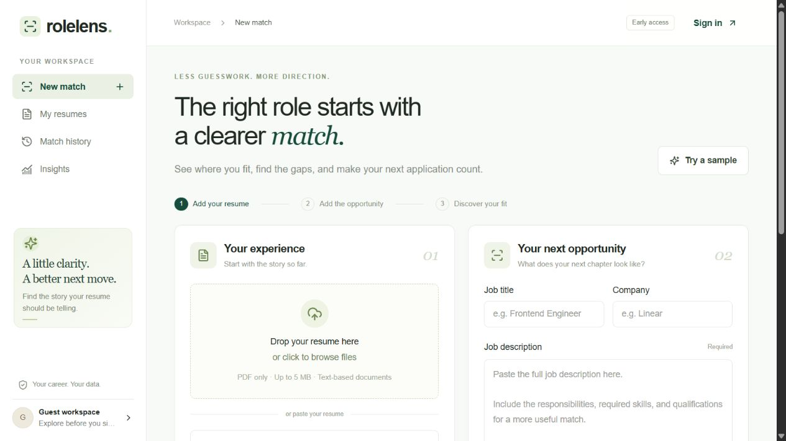
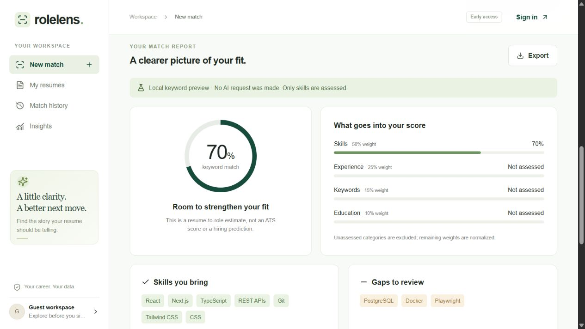

# RoleLens

A full-stack resume-to-job matcher that helps you compare your experience with a job description, understand skill gaps, and review evidence-based feedback.

**[Try RoleLens live](https://rolelens-resume.vercel.app)**

## Features

- Upload a text-based PDF (up to 5 MB) or paste resume text.
- Compare a resume with a job description using Gemini structured analysis and application-calculated scores.
- Explore a local keyword preview with built-in sample data—no account or AI request required.
- Save resume versions, revisit match history, and explore score and skill-gap insights.
- Review matching evidence and export reports as JSON.
- Sign in with password-based authentication and revocable cookie sessions.
- Responsive navigation, mobile/tablet account controls, loading skeletons, and subtle page/dialog animations.
- Logout confirmation, success notifications, password visibility controls, and reduced-motion support.

## Screenshots

Captured from the guest workspace with sample data; no private account or resume information is shown.





The sample report is a local keyword preview, not a Gemini-generated analysis.

## Stack

Next.js + React + TypeScript, Tailwind CSS, shadcn-style Button and Radix Dialog, Express REST API, PostgreSQL + Prisma, bcrypt + JWT cookies backed by revocable sessions, Multer + pdf-parse, Google Gemini API structured outputs, Recharts, Vitest, Playwright, Docker and GitHub Actions.

## Run locally

Node.js 24 is recommended.

1. `npm ci`
2. Copy `.env.example` to `.env`. Do not commit it.
3. `npm run db:generate`
4. `npm run dev`
5. Open http://127.0.0.1:3002. API: http://127.0.0.1:4002.

Local keyword preview and PDF extraction work without database or Gemini credentials. A sample can be loaded from the workspace. Demo reports are not stored or presented as AI reports.

## Enable real accounts and AI

Use your Neon/PostgreSQL database connection string as `DATABASE_URL`.
Alternatively, `docker compose up -d` creates a local development database using the sample URL (development credentials only).
Generate a secret with `node -e "console.log(require('crypto').randomBytes(32).toString('hex'))"` and put it in `JWT_SECRET`.
Run `npm run db:migrate`.
Set `GEMINI_API_KEY` and optionally `GEMINI_MODEL` (default `gemini-3.1-flash-lite`). API billing/account access is separate from a ChatGPT subscription.
Restart both servers after environment changes.
Use exactly `APP_ORIGIN` in the browser so same-origin checks pass.

## Architecture

- `src/components/`: workspace, evidence report, auth modal, analytics and UI primitives.
- `shared/matching.ts`: deterministic score calculation and explicitly limited demo matching.
- `server/index.ts`: Express REST routes, upload limits, request validation.
- `server/auth.ts`: signed HttpOnly cookies plus database sessions, logout revocation.
- `server/ai.ts`: structured extraction, untrusted-document instructions, no model-generated percentage.
- `prisma/`: relational schema and versioned migration.

Next.js proxies `/api/*` to Express via `API_INTERNAL_URL`. This keeps browser cookies same-origin.

## Scoring

Skills 50%, experience 25%, keywords 15%, education 10%.
Each assessed category is the percentage of its extracted requirements supported by the resume.
Unspecified categories are excluded and weights normalized. No evidence yields zero.
AI extraction is not deterministic and may be wrong even though score arithmetic is deterministic.
This is advisory document comparison, not an ATS score, hiring decision, or prediction.
Demo mode checks a limited vocabulary only; it never silently substitutes for failed AI requests.

## Data handling

PDFs are processed in memory, limited to 5 MB, and not retained as files. Only text-based PDFs are supported; no OCR.
Text is stored only on Save resume. Job descriptions and result evidence are stored when an authenticated user explicitly runs AI analysis.
AI analysis requires a consent checkbox before sending text to Gemini. Free-tier inputs may be used to improve Google products. Use sample or anonymized resumes, not sensitive personal data. Review Google's API terms before enabling real-user uploads.
Ownership is checked on every private record operation. JWTs are not kept in localStorage. Passwords are bcrypt-hashed.
No API keys, credentials or complete resume text are logged.
Password recovery uses emailed six-digit codes (10-minute expiry, five attempts, 60-second resend cooldown), a short-lived single-use reset token, and revokes existing sessions after a password change. It does not include signup email verification or original-PDF downloads.

### Password reset email

For Render Free, use the Brevo HTTPS integration. Verify your sender in Brevo and configure these backend-only variables:

```env
EMAIL_PROVIDER=brevo
BREVO_API_KEY=YOUR_BREVO_API_KEY
BREVO_SENDER_EMAIL=YOUR_VERIFIED_SENDER_EMAIL
```

Use an API key, not a Brevo SMTP key. Account activation/sending approval may be required. Free-mail senders cannot authenticate their domain; Brevo may replace the sender address with a compliant sending domain. A custom authenticated domain is preferable for production deliverability. SMTP remains available locally with `EMAIL_PROVIDER=smtp`; there is no automatic fallback on provider failure.

Set `SMTP_HOST`, `SMTP_PORT` (465 for Gmail), `SMTP_USER`, `SMTP_PASS` (Google App Password, never the account password), and `EMAIL_FROM` on the backend only. Apply `npm run db:migrate` before restarting the updated backend. Unregistered emails receive the same generic UI message but no email. Delivery failures are logged without credentials; the generic response does not guarantee inbox delivery.

**Hosting limitation:** Render Free blocks outbound SMTP ports 25, 465 and 587. Gmail SMTP requires an SMTP-capable host/plan; use an HTTPS email provider integration for a free Render deployment. See [Render Free limitations](https://render.com/docs/free). Do not publish SMTP credentials.

## Verification

`npm run typecheck`, `npm test`, `npm run build`.
`npx playwright install chromium` then `npm run test:e2e`.
CI runs these checks. Real PostgreSQL/AI end-to-end checks require configured credentials.

## Deployment: Vercel + Render + Neon

The frontend is deployed on Vercel, the Express API on Render, and PostgreSQL on Neon. Keep credentials on the backend; never commit `.env`.

### Vercel (frontend)

Select the Next.js framework and set:

```env
API_INTERNAL_URL=https://YOUR-BACKEND.onrender.com
```

### Render (backend)

Use the Node runtime with the repository root as the working directory.

Build: `npm ci --include=dev && npm run db:generate && npx tsc -p server/tsconfig.json`

Start: `node dist/server/index.js`

```env
NODE_ENV=production
PORT=10000
API_PORT=10000
APP_ORIGIN=https://rolelens-resume.vercel.app
DATABASE_URL=YOUR_NEON_CONNECTION_STRING
JWT_SECRET=YOUR_RANDOM_SECRET_AT_LEAST_32_CHARACTERS
GEMINI_API_KEY=YOUR_GEMINI_KEY
GEMINI_MODEL=gemini-3.1-flash-lite
```

The current API reads `API_PORT`; set it to the same value as Render's `PORT`. `APP_ORIGIN` must exactly match your frontend origin, without a trailing slash. Update it after any frontend domain change to avoid rejected POST requests. Use plain values, not Markdown links. Redeploy after changing environment variables.

- Vercel: deploy this directory with Next.js; set `API_INTERNAL_URL` to your HTTPS Express service.
- Do not use `npm start` for a backend-only Render service: that script launches both servers.
- Set backend `APP_ORIGIN` to the exact public frontend origin, `NODE_ENV=production`, `DATABASE_URL`, `JWT_SECRET`, and `GEMINI_API_KEY`.
- Run `npm run db:migrate` once as a release step.
- Dockerfile runs both servers; Docker Compose currently provides only the development database.

Before a public production launch: configure a shared rate-limit store, add per-account AI quotas and cost monitoring, isolate PDF parsing with process/memory/time limits, add email verification/recovery, automate data retention/deletion, and complete database-backed security tests. Production trusts the hosting proxy chain and uses the forwarded client IP; the current in-memory rate limits remain per process.
